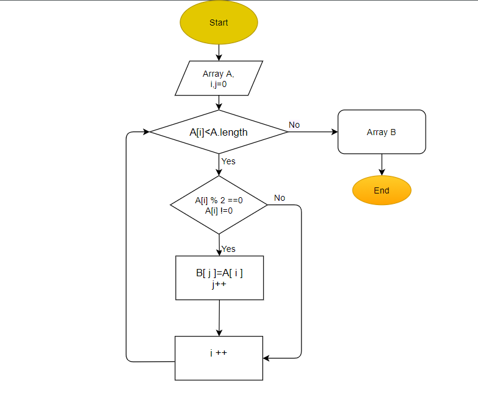

## Решение задачи
 
_Ccылка_ https://drive.google.com/file/d/1gaL1IatsXcv3XCyLlDUj4cPm3g6N3DM1/view?usp=sharing 

В начале напишем 2 метода по созданию массива А и его печати на экран для визуального восприятия. 
Массив будет сгенерирован случайным образом из диапазона числе [-10, 10]
Второй метод по подсчету количества чётных чисел

## После чего напишем метод, который решает поставленную задачу: 
на вход подаём наш исходный массив и количество его чётных чисел
Начинаем пробегать по массиву начиная с 0 элемента A[0]

Затем идёт проверка на условие чётности путём деления на 2 без остатка и условия не равности нули для предотварщения внесения 0 в новый массив. Если условие выполнено, то запоминаем этот элемент, выводим в консоль и увеличиваем индекс. 
